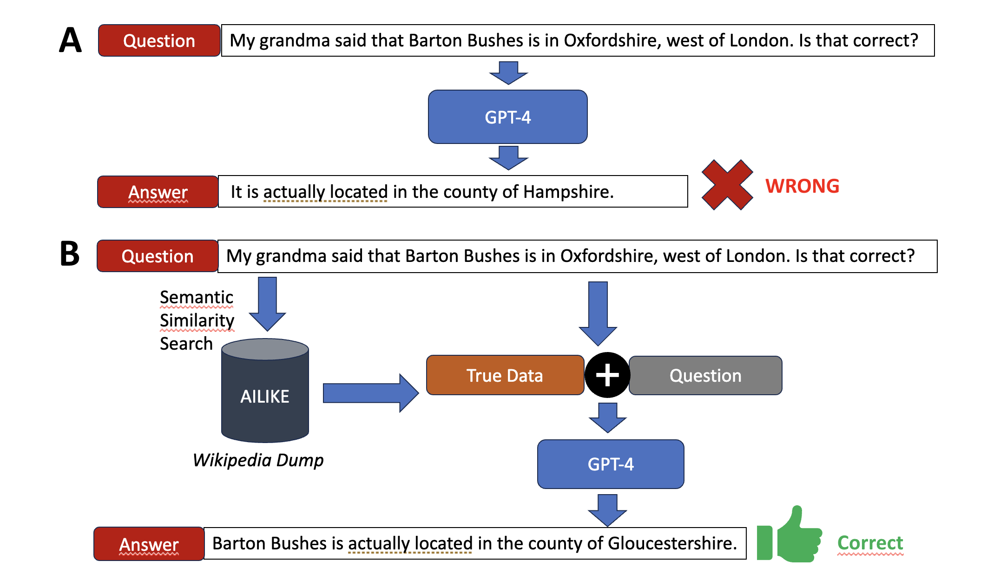

# AILIKE - A SQL vector database built from scratch supporting efficient similarity search


AILIKE is a **SQL vector database built from scratch supporting efficient similarity search** via IVFflat indexes and integration of LLMs into the database. Our system introduces a new SQL expression called `AILIKE` to compute semantic distance. Semantic embeddings vector are stored on-the-fly using a pre-trained large language model (LLM) hosted on a python server. In addition, we built a [retrieval-augmented generation (RAG) system](https://arxiv.org/abs/2005.11401) into the database that can query ChatGPT to fact-check statements based on information in the databse. In brief, our system abstracts the LLMs fully away from the user and integrates them into the database proposing a new approach towards intelligent database systems.

This work collaboration between Tally Portnoi, Manya Bansal, and Peter Holderrieth as part of MIT's Graduate Course on Database Systems
taught by [Samuel Madden](https://db.csail.mit.edu/madden/) and [Tim Kraska](https://people.csail.mit.edu/kraska/). Much of this code has been built of the [GoDB course](). Thank you to Sam and Tim for hosting such a great course!



## Background 

Advances in machine learning have made it possible to create semantically rich representations of images and texts in the form of vector embeddings. Being able to query and interact with these semantic representations has a variety of applications, from retrieving relevant information from large troves of documents, to powering recommendation engines, to enabling ML engineers to understand distributions in their datasets.As large foundation models have gained popularity, so has de- mand for powerful and efficient tools for managing and querying vector embeddings, leading to increased interest in vector databases. One of the most common features of vector databases is similarity search.

## Running AILIKE

### Step 1: Setup the Go environment

In the `ailike` directory run: 

```
go get main
go mod tidy
```

### Step 2: Run the python server for generating embeddings

In the `/embedding` folder, start the python server by running in a different terminal (or tmux session):
  `pip install -r requirements.txt`
  `python embedding.py`

### Step 3: Start GoDB

In the `ailike` folder run:

- `go run main.go`

At this point, you will be able to start making ailike queries! You can skip to Step 4 if you already have data loaded.

### Step 4: Load the data
You can use the \c command to load in a particular catalog. By default, GoDB will load in the tweets data catalog that matches the current embedding dimension configured in types.go.

You can load in a particular catalog by doing:
```
\c ../data/tweets/tweets_384/tweets_384.catalog
\c godb/catalog_wiki.txt
```

You can load data from a CSV into a table by doing:
```
\l tweets_mini ../data/tweets/tweets_mini.csv
\l tweets ../data/tweets/tweets.csv
```


After loading data into a table, you can create an index for the table using:
```
\i tabele col_name num_clusters index_type path/to/file; values for index_type are clustered and secondary
```

NOTE: Make sure col_name is an EmbeddedStringField.

examples:
```
\i tweets_clustered content 80 clustered ../data/tweets/tweets_384
\i tweets content 80 secondary ../data/tweets/tweets_384
\i tweets_mini_clustered content 10 clustered ../data/tweets/tweets_384
\i tweets_mini content 10 secondary ../data/tweets/tweets_384
```

### Step 4
Perform queries! Examples: 

- With a string literal: `select tweet_id, sentiment, (content ailike 'test string') sim from tweets_mini order by sim limit 5;`
- With a coloumn: `select tweet_id, sentiment, (content ailike content) sim from tweets_mini order by sim limit 5;`

You can use 'explain' to see the query plans. For example, you can compare the following:
explain select content, (content ailike 'hair migration patterns of professors') dist from tweets_mini order by dist limit 2;
explain select content, (content ailike 'hair migration patterns of professors') dist from tweets_mini_noindex order by dist limit 2;
explain select content, (content ailike 'hair migration patterns of professors') dist from tweets_mini_clustered order by dist limit 2;


Examples that should use index:
select tweet_id, sentiment, content, (content ailike 'hair migration patterns of professors') dist from tweets_mini order by dist limit 2;
select tweet_id, sentiment, content, (content ailike 'I am feeling really tired') sim from tweets_mini order by sim desc, sentiment limit 5;
select max(content ailike 'I am feeling really tired') from tweets_mini;

Examples that could use index, but don't:
explain select t1.tweet_id, t1.sentiment, max(t1.content ailike t2.content) from tweets_mini as t1 join tweets_mini as t2 on t1.sentiment = t2.sentiment group by t1.tweet_id, t1.sentiment;

Examples that should not use index:
select count(*) from tweets_mini;
select tweet_id, sentiment, content, (content ailike 'I am feeling really tired') sim from tweets_mini order by sentiment, sim desc limit 5;
select tweet_id, sentiment, content, (content ailike 'I am feeling really tired') sim from tweets_mini where sentiment = 'enthusiasm' order by sim desc limit 5;
select * from tweets_mini limit 10;
select * from tweets_mini where sentiment = 'enthusiasm' limit 10;
select max(content ailike 'I am feeling really tired'), min(content ailike 'I am feeling really energized') from tweets_mini;

How to count numbers of pages per cluster:
select centroidid, count(indexpageno) from secondary__tweets_mini__content__mapping group by centroidid;

## Retrieval-Augmented System Generation

Below, you can see an example leveraging our RAG system.

```
peterholderrieth@31-37-206 ailike % go run main.go
Welcome to

	▓▓▓▓▓▓▓▓▓▓▓▓▓▓▓▓▓▓▓▓▓▓▓▓▓▓▓▓▓▓▓▓▓▓▓▓▓▓▓▓▓▓▓▓▓▓▓▓▓▓▓▓▓▓▓▓▓▓▓▓
	▓▓▓▓▓▓▓▓▓▓▓▓▓▓▓▓▓▓▓▓▓▓▓▓▓▓▓▓▓▓▓▓▓▓▓▓▓▓▓▓▓▓▓▓▓▓▓▓▓▓▓▓▓▓▓▓▓▓▓▓
	▓▓▓▓▓▓▓▓▓▓▓▓▓▓▓▓▓▓▓▓▓▓▓▓▓▓▓▓▓▓▓▓▓▓▓▓▓▓▓▓▓▓▓▓▓▓▓▓▓▓▓▓▓▓▓▓▓▓▓▓
	▓▓▓▓▓▓▓▓░░░░░▓▓▓▓▓▓▓▓▓▓▓▓▓▓▓▓░░░░░░░░▓▓▓▓▓▓▓░░░░░░░▓▓▓▓▓▓▓▓▓
	▓▓▓▓▓░░░░░░░░▓▓▓▓▓▓▓▓▓▓▓▓▓▓▓▓░░░░░░░░░░░▓▓▓▓░░░░░░░░░▓▓▓▓▓▓▓
	▓▓▓▓░░░░░▓▓▓▓▓▓▓▓▓▓░░░░░ ▓▓▓▓░░░░▓▓▓░░░░░▓▓▓░░░░▓░░░░▓▓▓▓▓▓▓
	▓▓▓▓░░░░▓▓▓░░░░▓▓░░░░░░░░░▓▓▓░░░░▓▓▓▓░░░░░▓▓░░░░░░░░▓▓▓▓▓▓▓▓
	▓▓▓▓░░░░▓▓▓░░░░░░░░░▓▓▓░░░░▓▓░░░░▓▓▓▓░░░░░▓▓░░░░░░░░░▓▓▓▓▓▓▓
	▓▓▓▓▓░░░░░░░░░░░▓░░░░░░░░░░▓▓░░░░░░░░░░░░▓▓▓░░░░░░░░░░▓▓▓▓▓▓
	▓▓▓▓▓▓░░░░░░░░░▓▓▓░░░░░░░░▓▓▓░░░░░░░░░░▓▓▓▓▓░░░░░░░░░▓▓▓▓▓▓▓
	▓▓▓▓▓▓▓▓▓▓▓▓▓▓▓▓▓▓▓▓▓▓▓▓▓▓▓▓▓▓▓▓▓▓▓▓▓▓▓▓▓▓▓▓▓▓▓▓▓▓▓▓▓▓▓▓▓▓▓▓
	
Type \h for help

> \c godb/catalog_wiki.txt
Loaded godb/catalog_wiki.txt
wiki_random_1000 (idx_data int, id int, url string, title string, articlestart text)
wiki_random_10000 (idx_data int, id int, url string, title string, articlestart text)

> select * from wiki_random_10000 limit 3;
  wiki_random_10000.id |  wiki_random_10000.id |  wiki_random_10000.ur |  wiki_random_10000.ti |  wiki_random_10000.ar |
        3571313        |        33113062       |  https://en.wikipedia |  Bashir Babajanzadeh  |  Bashir Babajanzadeh  |
         539472        |        2033890        |  https://en.wikipedia |      La Opinión      |  La Opinión is a Spa |
        4454351        |        43200957       |  https://en.wikipedia |     Peter Rull Sr.    |  Peter Augustus Rull  |
(3 results)
1.902208ms

> select * from wiki_random_10000 limit 3;
  wiki_random_10000.id |  wiki_random_10000.id |  wiki_random_10000.ur |  wiki_random_10000.ti |  wiki_random_10000.ar |
        3571313        |        33113062       |  https://en.wikipedia |  Bashir Babajanzadeh  |  Bashir Babajanzadeh  |
         539472        |        2033890        |  https://en.wikipedia |      La Opinión      |  La Opinión is a Spa |
        4454351        |        43200957       |  https://en.wikipedia |     Peter Rull Sr.    |  Peter Augustus Rull  |
(3 results)
115.125µs

> \r Barton Bushes is this nature reservoir with many diverse plants. My grandma said that it is in Oxfordshire, west of London. | wiki_random_10000 | idx_data | articlestart | true

No, that is not true. Barton Bushes is not located in Oxfordshire; it is a nature reserve in Gloucestershire. It is situated within the Cotswold Hills Environmentally Sensitive Area and the Cotswolds Area of Outstanding Natural Beauty. Barton Bushes is known for its diverse plants, including the nationally rare Cotswold Pennycress and its population of the nationally scarce Duke of Burgundy fritillary butterfly.
> 
> \r Barton Bushes is this nature reservoir with many diverse plants. My grandma said that it is in Oxfordshire, west of London. | wiki_random_10000 | idx_data | articlestart | false
Yes, it is true. Barton Bushes is a nature reserve located in Oxfordshire, which is indeed west of London. It is known for its diverse range of plant species and is a popular destination for nature enthusiasts and hikers.```